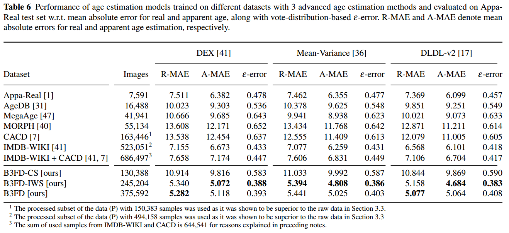

# The B3FD Dataset
The B3FD dataset is a publicaly available unconstrained facial image dataset for age estimation introduced in the paper [Picking out the bad apples: unsupervised biometric data filtering for
refined age estimation](https://rdcu.be/cECBE).

B3FD stands for **B**iometrically **F**iltered **F**amous **F**igure **D**ataset. B3FD is a new dataset derived from [IMDB-WIKI](https://data.vision.ee.ethz.ch/cvl/rrothe/imdb-wiki/) and [CACD](https://bcsiriuschen.github.io/CARC/) datasets, automatically cleaned of faulty web-scraped samples by the unsupervised biometric filtering methods proposed in the paper. 53% of samples were removed from the [IMDB-WIKI](https://data.vision.ee.ethz.ch/cvl/rrothe/imdb-wiki/) data and 20% from the [CACD](https://bcsiriuschen.github.io/CARC/) data. The remaining dataset contains 375,592 facial image samples with corresponding age labels. It has 53,759 unique subjects, which amounts to 6.99 samples per subject on average. The age labels are ranging from 0 to 100. 

The B3FD datasets is composed of two main subsets; the [IMDB-WIKI](https://data.vision.ee.ethz.ch/cvl/rrothe/imdb-wiki/) subset (i.e., B3FD-IWS) and the [CACD](https://bcsiriuschen.github.io/CARC/) subset (i.e., B3FD-CS). These subsets can be useful in case of data-origin based constraints (e.g. only IMDB-WIKI data can be used). B3FD-IWS consists of 245,204 processed samples from the [IMDB-WIKI](https://data.vision.ee.ethz.ch/cvl/rrothe/imdb-wiki/) dataset with 53,568 unique subjects, which amounts to 4.58 samples per subject on average. B3FD-CS consists of 130,388 processed samples from the [CACD](https://bcsiriuschen.github.io/CARC/) dataset with 1,831 unique subjects, which amounts to 71.21 samples per subject. 

As is demonstrated in the paper and presented in the following table, the B3FD data **outperforms all the other evaluated publicly available datasets for age estimation**. 



# Download
The B3FD images and labels are publically available for academic use.

## Images
Download link (5.73 GB): [B3FD_images.tar.gz](https://ferhr-my.sharepoint.com/:u:/g/personal/kbr122017_fer_hr/EU4lr6xf_ZhBi9vN_i8h_XEByhasE-qqKlcC7iqk5K9XtQ?e=Yox63W).

md5sum: d492a8b7095cc1012b10dc978fb3c8f5

All images in the dataset are pre-aligned, cropped with 50% of context, and resized to 256x256p. For more information about the image processing approach, refer to Section 3.1.1 - _Detection and alignment_.  

## Metadata
Download link (9.76 MB): [B3FD_metadata.tar.gz](https://ferhr-my.sharepoint.com/:u:/g/personal/kbr122017_fer_hr/EcKiZtbTTb5Ep-fN32wCx4oBIcY64Wr8JhxlgPkV33M7cg?e=Q6NtUX).

md5sum: ece599dde9a5df2ccf7473a31816f418

The basic metadata for the B3FD dataset is available under _B3FD_metadata/B3FD_age.csv_. The csv file contains pairs of image paths and age labels.

The basic metadata for the B3FD-IWS ([IMDB-WIKI](https://data.vision.ee.ethz.ch/cvl/rrothe/imdb-wiki/)) and B3FD-CS ([CACD](https://bcsiriuschen.github.io/CARC/)) subsets is available under _B3FD_metadata/B3FD-IWS_age.csv_ and _B3FD_metadata/B3FD-CS_age.csv_, respectively. The csv files contain pairs of image paths and age labels.

Since the [IMDB-WIKI](https://data.vision.ee.ethz.ch/cvl/rrothe/imdb-wiki/) dataset provides gender lables along with age, we also provide two additional csv files that include gender labels: _B3FD_metadata/B3FD-IMDB_age_gender.csv_ and _B3FD_metadata/B3FD-WIKI_age_gender.csv_.

## Filtration lists
Download link (2.42 MB): [B3FD_filtration_lists.tar.gz](https://ferhr-my.sharepoint.com/:u:/g/personal/kbr122017_fer_hr/EZfv3QcfwlFKjaESDBsMpbUByksKjr4K39X3adcT4vugiA?e=ntsnKr).

md5sum: 0e27332f23babc23a15f4ee3bc9cb790

If you wish to apply a different image processing method, you can apply the provided filtration lists to the original [IMDB-WIKI](https://data.vision.ee.ethz.ch/cvl/rrothe/imdb-wiki/) and [CACD](https://bcsiriuschen.github.io/CARC/) datasets and still benefit from our filtering method. 

# Citation
If you find this dataset usefull and decide to use any of the provided data, please use the following citation in your work:
```
@article{bevsenic2022picking,
  title={Picking out the bad apples: unsupervised biometric data filtering for refined age estimation},
  author={Be{\v{s}}eni{\'c}, Kre{\v{s}}imir and Ahlberg, J{\"o}rgen and Pand{\v{z}}i{\'c}, Igor S},
  journal={The Visual Computer},
  pages={1--19},
  year={2022},
  publisher={Springer}
}
```

# License
Please notice that this dataset is made available for academic research purpose only. All the images and labels are derived from the [IMDB-WIKI](https://data.vision.ee.ethz.ch/cvl/rrothe/imdb-wiki/) and [CACD](https://bcsiriuschen.github.io/CARC/) datasets and the copyright belongs to the original owners.
